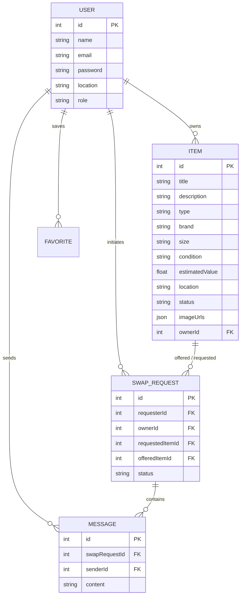

# Product Requirement Document (PRD)

## Project Name: SwapMarket 👗♻️
**Tagline:** Sustainable Clothing Exchange Marketplace  
**Version:** 1.0.0  
**Author:** Mirza Aaqib Baig  
**Status:** Production Ready / Deployed  

---

## 1. Executive Summary

**SwapMarket** is a peer-to-peer digital marketplace platform designed to promote sustainable fashion by enabling users to trade pre-loved clothing items directly with one another without monetary transactions. By combining circular fashion principles with modern web usability, SwapMarket provides a cashless ecosystem where users list items they no longer wear and request swaps for items listed by others in their community.

---

## 2. Problem Statement & Market Need

### Problem
- **Fast Fashion Waste:** Text Industry generates millions of tons of textile waste annually.
- **Underutilized Wardrobes:** Average consumers wear less than 50% of the clothing in their closets.
- **Financial Barrier:** Buying new sustainable clothing brands can be prohibitively expensive.

### Solution
SwapMarket solves these problems by providing:
1. A **cashless value exchange platform** for pre-loved fashion.
2. Localized discovery to reduce shipping emissions and build community connections.
3. A gamified, intuitive web interface encouraging eco-conscious consumption choices.

---

## 3. Product Goals & Key Success Metrics

| Goal Category | Objective | Success Metric |
|---|---|---|
| **User Engagement** | High interaction per listing | Average of 3+ swap inquiries per listed item |
| **Sustainability Impact** | Extend clothing lifecycle | 1,000+ completed item swaps in Year 1 |
| **Platform Trust** | Clean & safe environment | < 1% user report rate with active admin moderation |
| **Performance** | Seamless user experience | Page load times < 1.5s; 99.9% uptime |

---

## 4. Target Audience & User Personas

1. **Eco-Conscious Gen Z / Millennial (Primary Persona: "Sustainably Stylish Sam")**
   - *Behavior:* Loves fashion, frequents thrift stores, wants to reduce carbon footprint.
   - *Goal:* Refresh wardrobe frequently without spending money or contributing to fast-fashion waste.

2. **Declutterer (Secondary Persona: "Minimalist Maya")**
   - *Behavior:* Clearing out closet post-season or after lifestyle changes.
   - *Goal:* Pass quality clothes to someone who will appreciate them rather than throwing them away.

3. **Community Administrator (Admin Persona: "Moderator Alex")**
   - *Behavior:* Platform owner maintaining safety and content quality.
   - *Goal:* Monitor reported items, manage spam users, inspect transaction history.

---

## 5. System Features & Functional Requirements

### 5.1 Authentication & User Profiles
- **JWT-Based Authentication:** Secure registration and login with encrypted password hashing (`bcryptjs`).
- **Role-Based Access Control (RBAC):** `user` vs `admin` privilege separation.
- **User Profile Management:** Displays user details, listed items, activity stats, and location.

### 5.2 Item Catalog & Management
- **Item Creation:** Users can list items specifying:
  - Title, Description, Type (Shirt, Pants, Jacket, Dress, Accessories, etc.)
  - Brand, Size, Condition (New with tags, Like New, Good, Fair)
  - Estimated Value ($), Location, and Multiple Image URLs.
- **Item Detail View:** Rich image gallery, owner details, condition tags, estimated value badge, and instant "Request Swap" call to action.
- **CRUD Operations:** Owners can edit or delete their listed items.

### 5.3 Discovery & Filtering Engine
- **Full-Text Search:** Real-time search across titles, descriptions, and brands.
- **Multi-Parametric Filters:** Filter by category, condition, size range, and location.
- **Sorting Options:** Sort listings by newest, value high-to-low, or low-to-high.

### 5.4 Peer-to-Peer Swap Request Engine
- **Propose Swap:** Users select an item from their own inventory to offer in exchange for another user's item.
- **Status Lifecycle:**
  `Pending` ➔ `Accepted` OR `Rejected` ➔ `Completed`
- **Exchange Balance Guard:** Visual feedback on estimated item value parity.

### 5.5 In-App Messaging & Communication
- **Contextual Chat:** Dedicated chat room automatically instantiated upon swap request acceptance.
- **Real-Time Log:** Messaging history stored with timestamps and active participant state.

### 5.6 Favorites / Wishlist
- **1-Click Bookmark:** Save items to personal favorites list.
- **Quick Access:** Favorites page for rapid tracking of saved items.

### 5.7 Notification System
- **Event Triggers:** Automated alerts generated when:
  - A new swap request is received
  - A swap request is accepted or declined
  - A new message is received

### 5.8 UI/UX Design System & Dynamic Theme
- **Dual Theme Support:** Fully responsive Dark Mode 🌙 and Light Mode ☀️ toggle with persistent localStorage preference.
- **Modern Micro-Animations:** Smooth hover transitions, interactive modal dialogs, and toast notifications built with TailwindCSS.

### 5.9 Administration Panel
- **User Directory Management:** View all registered accounts, modify roles, or ban accounts.
- **Content Moderation:** Remove inappropriate or fraudulent listings.
- **Platform Analytics:** Total user metrics, total items listed, and completed swap counters.

---

## 6. Technical Architecture & Data Schema

### 6.1 Technology Stack

```
           +---------------------------------------------+
           |           React 18 + Vite + Tailwind        |
           |             (Hosted on Vercel)              |
           +----------------------+----------------------+
                                  | HTTP / REST API (JWT)
                                  v
           +---------------------------------------------+
           |             Express.js + Node.js            |
           |             (Hosted on Render)              |
           +----------------------+----------------------+
                                  | Sequelize ORM
                                  v
           +---------------------------------------------+
           |               SQLite Database               |
           +---------------------------------------------+
```

### 6.2 Data Schema Architecture



---

## 7. Deployment & Infrastructure

| Environment | Hosting Provider | Configuration | Live URL |
|---|---|---|---|
| **Frontend** | Vercel | SPA rewrite rules (`vercel.json`), Vite preset | `https://swapmarket-three.vercel.app/` |
| **Backend** | Render | Node.js Web Service, Singapore Region | `https://swapmarket.onrender.com/` |
| **Database** | Render Persistent Disk | SQLite via Sequelize ORM | Auto-synced |

---

## 8. Security & Non-Functional Requirements

- **Authentication Security:** Passwords hashed with `bcryptjs` (salt rounds: 10). Access tokens issued via JSON Web Token (JWT) with authorization header checking (`Bearer <token>`).
- **Data Protection:** CORS configuration enabled for authenticated cross-origin API requests.
- **Scalability Path:** SQLite database can be migrated to PostgreSQL via Sequelize config without altering business logic.
- **Responsiveness:** Mobile-first layout breakpoints (sm, md, lg, xl) tested across modern smartphone and desktop browsers.

---

## 9. Future Product Roadmap (v2.0)

- [ ] **Geolocation Matching:** Interactive map integrating Google Maps API to show items nearby.
- [ ] **Push Notifications:** Web Push / Service Workers for real-time mobile updates.
- [ ] **AI-Powered Item Valuation:** Automatic estimated value suggestions based on uploaded item photos.
- [ ] **Direct Shipping Labels:** Integration with logistics APIs (e.g. EasyPost) for prepaid shipping label generation.
